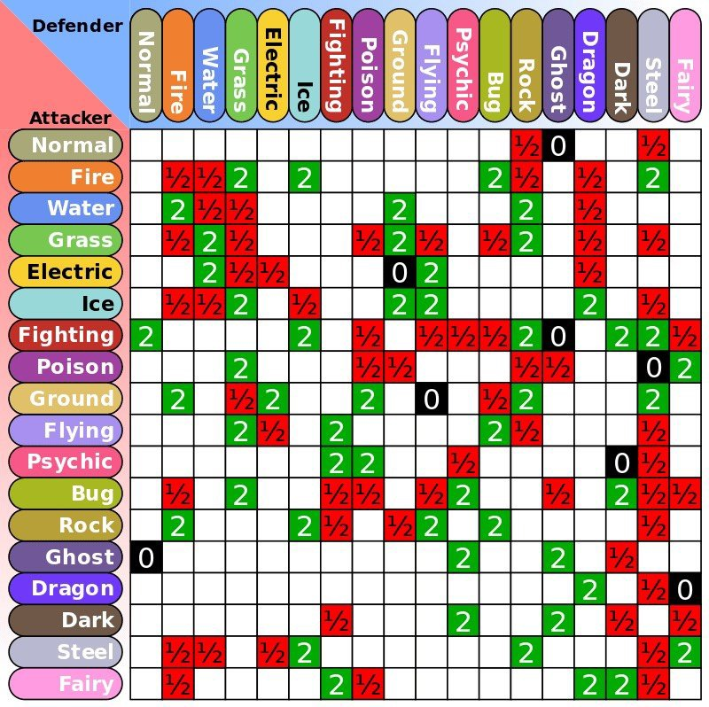
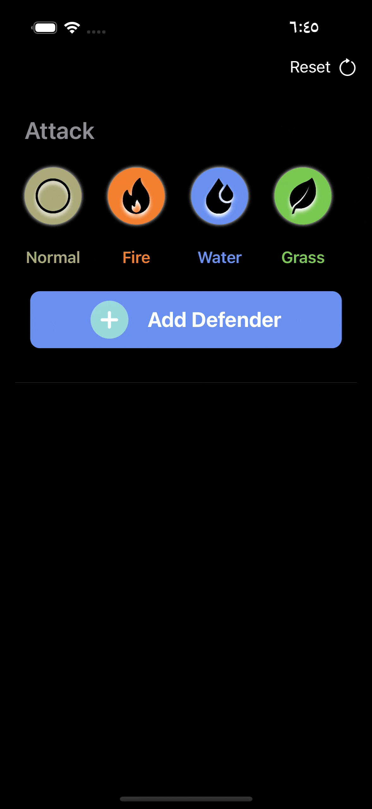

# Bulbasaur

A Pokémon may have either one or two types. For instance, Charmander is a Fire type, while Bulbasaur is both a Grass type and a Poison type. With this system and there currently being 18 types, there is a total of 324 possible ways to assign types to Pokémon, with 171 unique combinations, 162 of which have been used as of Generation IX. Similar to Pokémon, Pokéstar Studios opponents also have types.

## This is a simple matrix of the game logic:

## DEMO

